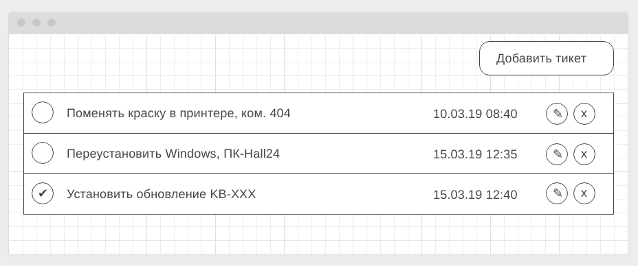
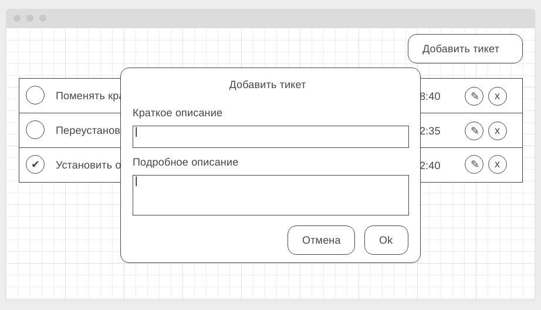
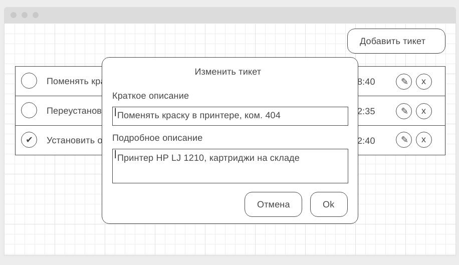
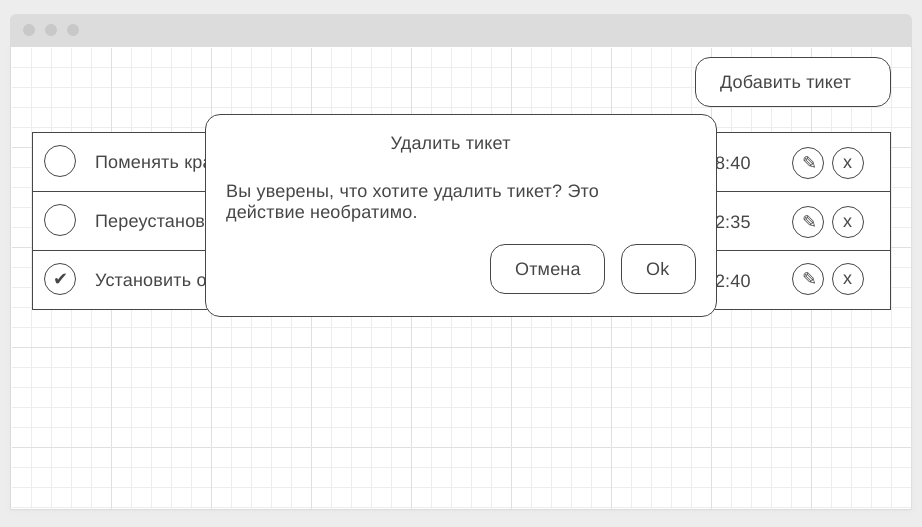
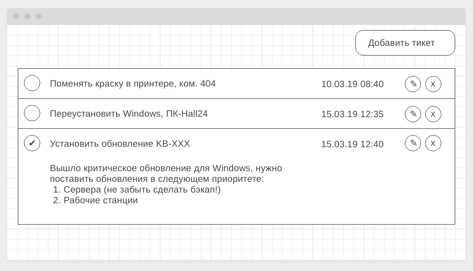

# Домашнее задание к занятию "7. Работа с HTTP"
Правила сдачи задания:

Важно: в рамках этого домашнего задания нужно использовать npm (а значит, никакого yarn.lock в репозитории быть не должно)
Frontend должен собираться через Webpack (включая картинки и стили) и выкладываться на Github Pages через Github Actions. Пример реализации деплоя был в первой домашней работе из этого блока, называется "Рабочее окружение".
В README.md должен быть размещён бейджик сборки и ссылка на Github Pages
В качестве результата присылайте проверяющему ссылки на GitHub-репозиторий
Авто-тесты писать не требуется
Важно: в данном домашнем задании вам потребуется выполнить мини-проект. Мы понимаем, что он может занять чуть больше времени, чем обычные задания, но тема HTTP настолько важна, что стоит уделить этому чуть больше времени.

HelpDesk
Легенда
Backend-разработчик вернулся из отпуска, поэтому писать прототип API для сервиса управления заявками уже не нужно, оно готово.

Ознакомиться с ним можно здесь.

Описание
Описание API. Для хранения данных мы будем оперировать следующими структурами:

Ticket
{
    id // идентификатор (уникальный в пределах системы)
    name // краткое описание
    status // boolean - сделано или нет
    description // полное описание
    created // дата создания (timestamp)
}
Обратите внимание бэкенд вашего приложения принимает данные в формате JSON. Это означает, что передаваемые данные должны быть сериализованы в JSON-строку, а также необходимо установить правильный заголовок в HTTP-запросе (application/json).

Примеры запросов:

GET    ?method=allTickets - список тикетов
GET    ?method=ticketById&id=<id> - полное описание тикета (где <id> - идентификатор тикета)
POST   ?method=createTicket - создание тикета (<id> генерируется на сервере, в теле формы name, description, status)
Соответственно:

POST   ?method=createTicket - в теле запроса форма с полями для объекта типа Ticket (с id = null)
POST   ?method=updateById&id=<id> - в теле запроса форма с полями для обновления объекта типа Ticket по id
GET    ?method=allTickets  - массив объектов типа Ticket (т.е. без description)
GET    ?method=ticketById&id=<id> - объект типа Ticket
GET    ?method=deleteById&id=<id> - удалить объект типа Ticket по id, при успешном запросе статус ответа 204
Код ниже позволит обработать полученный ответ от сервера во Frontend:

xhr.addEventListener('load', () => {
    if (xhr.status >= 200 && xhr.status < 300) {
        try {
            const data = JSON.parse(xhr.responseText);
        } catch (e) {
            console.error(e);
        }
    }
});
HelpDesk: Frontend
Легенда
API готово, пора приступить к своим прямым обязанностям - написанию фронтенда, который будет с этим API работать.

Описание
Общий вид списка тикетов (должны загружаться с сервера в формате JSON):

Модальное окно добавления нового тикета (вызывается по кнопке "Добавить тикет" в правом верхнем углу):

Модальное окно редактирования существующего тикета (вызвается по кнопке с иконкой "✎" - карандашик):

Модальное окно подтверждения удаления (вызывается по кнопке с иконкой "x" - крестик):

Для просмотра деталей тикета нужно нажать на тело тикета (но не на кнопки - "сделано", "редактировать" или "удалить"):

Ваше приложение должно реализовывать следующий функционал:

Отображение всех тикетов
Создание нового тикета
Удаление тикета
Изменение(обновление) тикета
Отметка о выполнении каждого тикета
Весь этот функционал должен быть связан с сервером через методы. Например, для удаления нужно отправить запрос с соответствующим методом, получить подтверждение и подтянуть обновлённый список тасков.

В качестве бонуса можете отображать какую-нибудь иконку загрузки (см. https://loading.io) на время подгрузки.

Преднастроенный репозиторий для фронтенд части можно посмотреть здесь.

Вы можете реализовывать структуру, заложенную в нем, либо написать свою.

Авто-тесты к данной задаче не требуются. Все данные и изменения должны браться/сохраняться на сервере.

Заметка
P.S. Подгрузка подробного описания специально организована в виде отдельного запроса. Мы понимаем, что на малых объёмах информации нет смысла делать её отдельно.